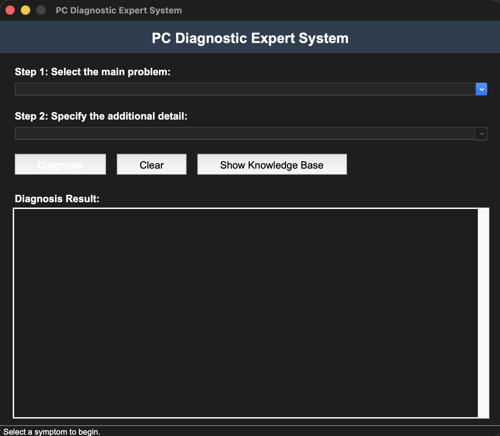
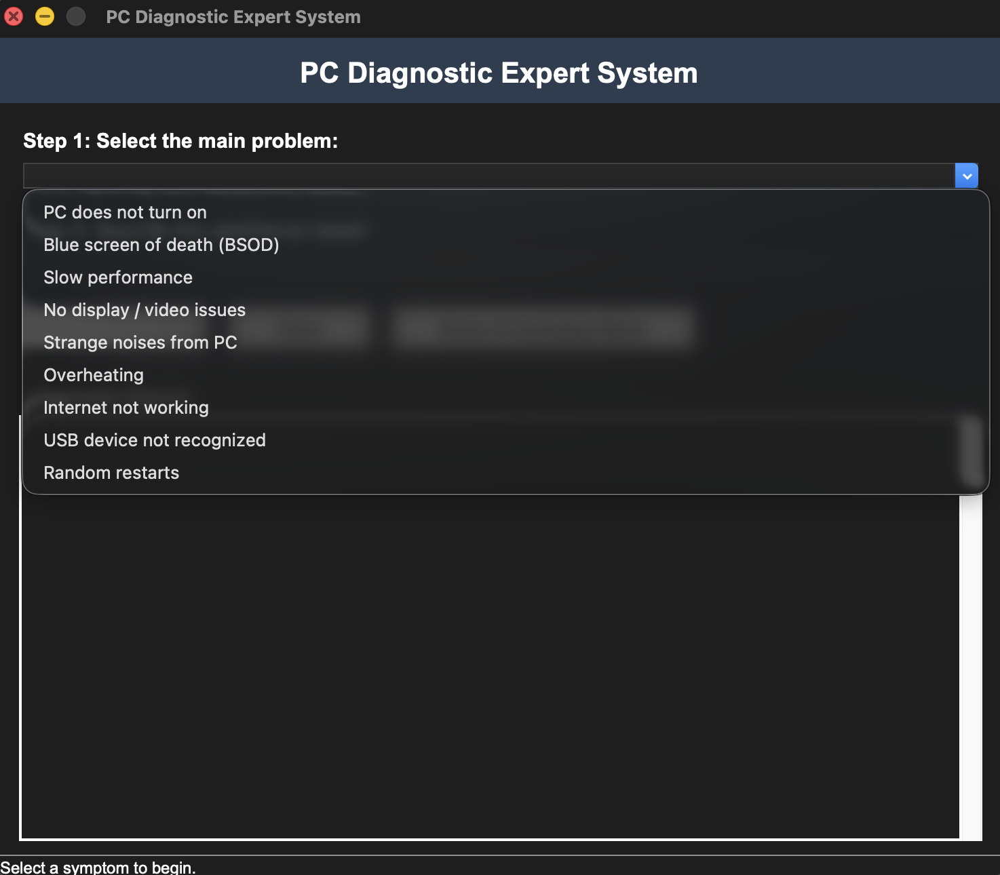
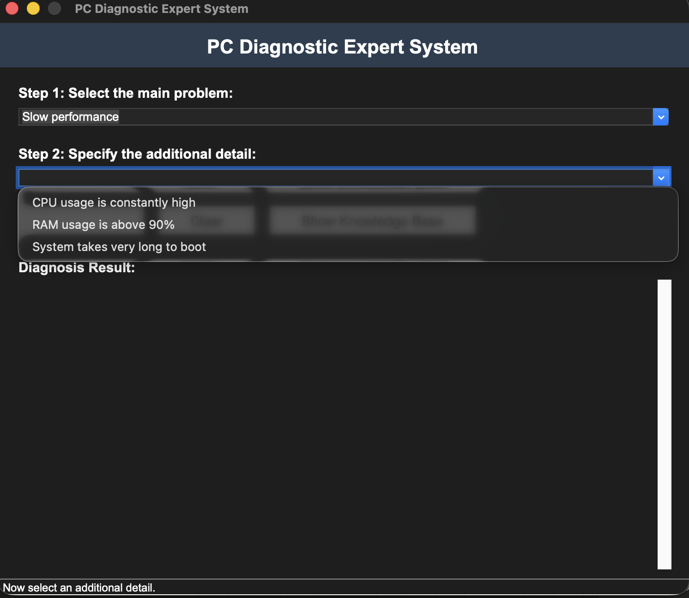
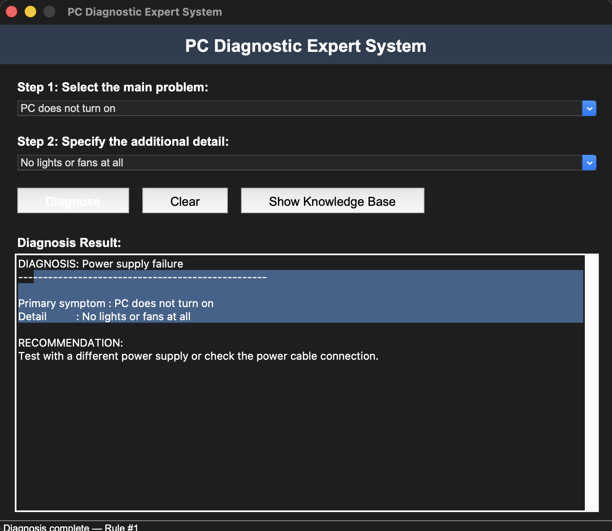
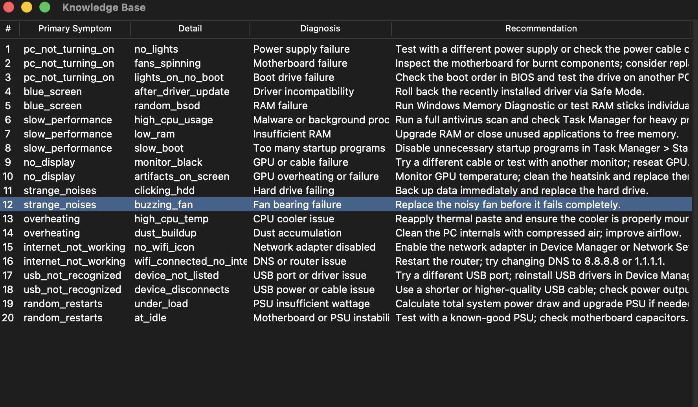

# Лабораторна робота №5

## Тема: Розробка експертної системи

**Мета:** Розробити та протестувати експертну систему для діагностики несправностей персонального комп'ютера з використанням Python (tkinter, pandas).

---

## 1. Коротка теоретична частина

### Що таке експертна система

Експертна система (ЕС) – це програма, яка імітує процес прийняття рішень фахівцем у певній предметній області. Класична ЕС складається з трьох компонентів: база знань (набір правил виду «якщо симптом A і симптом B, то діагноз C»), механізм виведення (inference engine), який зіставляє факти з правилами та знаходить відповідне рішення, та інтерфейс користувача, через який система отримує вхідні дані і видає результат.

У даній роботі реалізовано продукційну модель знань: кожне правило має вигляд «ЯКЩО (основний симптом) І (уточнюючий симптом) ТО (діагноз + рекомендація)». Механізм виведення працює методом прямого ланцюжка – від фактів (обрані симптоми) до висновку (діагноз).

### Чому tkinter

Tkinter – стандартна бібліотека Python для створення GUI. Вона входить до стандартного дистрибутива Python, не потребує встановлення зовнішніх залежностей і добре підходить для навчальних проєктів. Tkinter надає всі необхідні віджети: Combobox для вибору симптомів, ScrolledText для відображення результатів, Treeview для таблиці бази знань.

### Чому pandas

Pandas – бібліотека для роботи з табличними даними. DataFrame зручно використовувати як базу знань, оскільки він підтримує фільтрацію за кількома умовами одночасно, що ідеально підходить для механізму виведення: одним рядком коду можна знайти правило, де збігаються обидва симптоми.

---

## 2. Код із описом ключових моментів

### Структура проєкту

Проєкт розділено на три файли: `knowledge_base.py` (база знань + inference engine), `expert_system.py` (GUI), `test_expert_system.py` (тести). Такий поділ дозволяє тестувати логіку окремо від інтерфейсу.

### Клас DiagnosticSystem (механізм виведення)

```python
class DiagnosticSystem:
    """Inference engine for the PC diagnostic expert system."""

    def __init__(self):
        self.knowledge_base = pd.DataFrame(RULES_DATA)

    def diagnose(self, primary_symptom, secondary_symptom):
        """Find matching rules based on selected symptoms."""
        result = self.knowledge_base[
            (self.knowledge_base["symptom_1"] == primary_symptom)
            & (self.knowledge_base["symptom_2"] == secondary_symptom)
        ]
        return result

    def get_all_rules(self):
        """Return the full knowledge base."""
        return self.knowledge_base
```

Конструктор `__init__` створює pandas DataFrame з 20 правил. Метод `diagnose()` – це ядро системи: він фільтрує DataFrame за двома стовпцями одночасно і повертає рядок з діагнозом та рекомендацією. Метод `get_all_rules()` повертає всю базу знань для відображення у вікні перегляду.

### База знань (фрагмент)

```python
RULES_DATA = {
    "rule_id": list(range(1, 21)),
    "symptom_1": ["pc_not_turning_on", "pc_not_turning_on", ...],
    "symptom_2": ["no_lights", "fans_spinning", ...],
    "diagnosis": ["Power supply failure", "Motherboard failure", ...],
    "recommendation": ["Test with a different power supply...", ...],
}
```

База містить 20 правил, згрупованих у 9 категорій проблем. Кожна категорія має 2–3 уточнюючих симптоми, які дозволяють звузити діагноз до конкретної несправності.

### GUI – побудова інтерфейсу (фрагмент)

```python
class ExpertSystemGUI:
    def __init__(self, root):
        self.root = root
        self.root.title("PC Diagnostic Expert System")
        self.engine = DiagnosticSystem()
        self._build_ui()
```

GUI ініціалізує екземпляр DiagnosticSystem та будує інтерфейс. Основна ідея – двоетапний вибір: спочатку користувач обирає категорію проблеми (Combobox 1), потім другий Combobox динамічно заповнюється уточнюючими симптомами саме для цієї категорії.

**Рис. 1 — Головне вікно програми (початковий стан):**



### Динамічне оновлення другого списку

```python
def _on_primary_selected(self, _event=None):
    idx = self.primary_combo.current()
    primary_key = self._primary_key_from_index(idx)
    secondary_options = SECONDARY_SYMPTOMS[primary_key]
    self.secondary_combo.config(state="readonly")
    self.secondary_combo["values"] = list(secondary_options.values())
```

При виборі основного симптому обробник `_on_primary_selected` бере відповідний словник із `SECONDARY_SYMPTOMS` і оновлює другий Combobox. Це забезпечує контекстно-залежний вибір – користувач бачить тільки релевантні уточнення.

**Рис. 2 — Вибір основної категорії проблеми (Step 1):**



**Рис. 3 — Динамічний список уточнюючих симптомів (Step 2):**



### Виведення результату діагностики

```python
def _run_diagnosis(self):
    primary_key = self._primary_key_from_index(p_idx)
    secondary_key = self._secondary_key_from_index(primary_key, s_idx)
    result = self.engine.diagnose(primary_key, secondary_key)

    if result.empty:
        self.result_text.insert(tk.END, "No matching diagnosis found.\n")
    else:
        row = result.iloc[0]
        output = (
            f"DIAGNOSIS: {row['diagnosis']}\n"
            f"{'─' * 50}\n\n"
            f"Primary symptom : {SYMPTOM_CATEGORIES[primary_key]}\n"
            f"Detail          : {SECONDARY_SYMPTOMS[primary_key][secondary_key]}\n\n"
            f"RECOMMENDATION:\n{row['recommendation']}\n"
        )
        self.result_text.insert(tk.END, output)
```

Метод перетворює індекси Combobox на ключі, викликає `engine.diagnose()` і виводить діагноз разом з рекомендацією у текстове поле.

**Рис. 4 — Результат діагностики (Power supply failure):**



### Перегляд бази знань

Кнопка «Show Knowledge Base» відкриває окреме вікно (Toplevel) з віджетом Treeview, де відображаються всі 20 правил у табличному вигляді зі стовпцями: номер, основний симптом, уточнення, діагноз, рекомендація.

**Рис. 5 — Вікно перегляду бази знань (20 правил):**



---

## 3. Тестування

### Unit-тести

Файл `test_expert_system.py` містить 11 тестів, що покривають усі аспекти системи:

```
$ python3 -m unittest test_expert_system -v

test_all_categories_have_secondary ........... ok
test_all_rules_are_reachable ................. ok
test_diagnose_dns_issue ...................... ok
test_diagnose_hdd_failing .................... ok
test_diagnose_malware ........................ ok
test_diagnose_power_supply ................... ok
test_diagnose_ram_failure .................... ok
test_knowledge_base_columns .................. ok
test_knowledge_base_loaded ................... ok
test_no_match ................................ ok
test_recommendations_not_empty ............... ok

Ran 11 tests in 0.015s – OK
```

### Опис сценаріїв тестування

**Сценарій 1 – ПК не вмикається, індикатори не горять.**
Користувач обирає «PC does not turn on» → «No lights or fans at all».
Результат: діагноз «Power supply failure», рекомендація перевірити блок живлення.

**Сценарій 2 – Синій екран без очевидної причини.**
Користувач обирає «Blue screen of death (BSOD)» → «Appears randomly without clear cause».
Результат: діагноз «RAM failure», рекомендація запустити діагностику пам'яті.

**Сценарій 3 – Повільна робота з високим навантаженням CPU.**
Користувач обирає «Slow performance» → «CPU usage is constantly high».
Результат: діагноз «Malware or background processes», рекомендація перевірити антивірусом.

**Сценарій 4 – Клацання з області жорсткого диска.**
Користувач обирає «Strange noises from PC» → «Clicking sounds from hard drive area».
Результат: діагноз «Hard drive failing», рекомендація негайно зробити резервну копію.

**Сценарій 5 – Wi-Fi підключено, але інтернету немає.**
Користувач обирає «Internet not working» → «Connected to Wi-Fi but no internet access».
Результат: діагноз «DNS or router issue», рекомендація перезавантажити роутер та змінити DNS.

**Сценарій 6 – Некоректні вхідні дані.**
Тест `test_no_match` перевіряє, що система коректно обробляє неіснуючу комбінацію симптомів – повертає порожній результат.

---

## 4. Висновки

У ході лабораторної роботи було розроблено експертну систему для діагностики несправностей ПК. Система побудована за класичною архітектурою ЕС: база знань (20 продукційних правил у pandas DataFrame), механізм виведення (клас DiagnosticSystem з фільтрацією за двома симптомами) та інтерфейс користувача (tkinter GUI з двоетапним вибором).

Використання pandas дозволило компактно реалізувати механізм виведення – пошук за правилами зводиться до фільтрації DataFrame за двома стовпцями. Tkinter забезпечив простий та зрозумілий інтерфейс без зовнішніх залежностей. Розділення коду на модуль логіки та модуль GUI дало змогу написати unit-тести для бази знань незалежно від графічного інтерфейсу.

Усі 11 тестів пройшли успішно, що підтверджує коректність бази знань, зв'язність категорій з уточненнями та правильність роботи механізму виведення.
