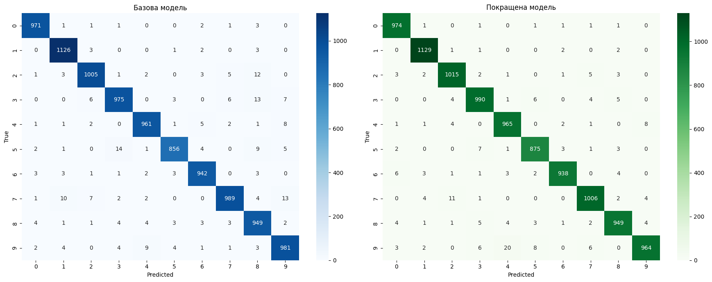
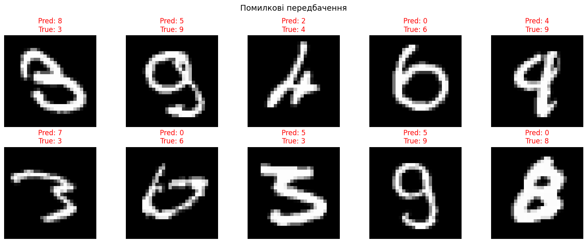

# Лабораторна робота №7

## Тема: Класифікація рукописних цифр (MNIST) із простою багатошаровою нейронною мережею

**Мета:** Ознайомитися з основними концепціями TensorFlow (тензори, шари, оптимізатор, функція втрат) на прикладі простої задачі класифікації зображень.

---

## 1. Коротка теоретична частина

### Датасет MNIST

MNIST – класичний датасет для задач розпізнавання зображень. Він містить 70 000 зображень рукописних цифр (0–9) розміром 28×28 пікселів у градаціях сірого. З них 60 000 зображень використовуються для навчання, а 10 000 – для тестування. Кожне зображення – це матриця зі значеннями пікселів від 0 до 255, де 0 відповідає чорному, а 255 – білому кольору.

### TensorFlow та Keras

TensorFlow – це відкрита бібліотека для машинного навчання від Google. Keras (інтегрований у TensorFlow як `tf.keras`) надає високорівневий API для побудови та навчання нейронних мереж. У роботі використано послідовну модель (`Sequential`), яка дозволяє створювати мережу шар за шаром.

### Ключові концепції

- **Нормалізація** – поділ значень пікселів на 255 переводить дані в діапазон [0, 1], що прискорює та стабілізує навчання.
- **Flatten** – перетворює 2D-зображення (28×28) в 1D-вектор (784 елементи) для подачі на Dense-шари.
- **Dense** – повнозв'язний шар, де кожен нейрон з'єднаний з усіма нейронами попереднього шару.
- **ReLU** – функція активації, що повертає max(0, x). Додає нелінійність, дозволяючи мережі вивчати складні закономірності.
- **Softmax** – функція активації вихідного шару для класифікації. Перетворює виходи в ймовірності, що сумуються до 1.
- **Dropout** – техніка регуляризації, що випадково «вимикає» частину нейронів під час навчання для запобігання перенавчанню.
- **Adam** – адаптивний оптимізатор, що автоматично підлаштовує швидкість навчання для кожного параметра.
- **sparse_categorical_crossentropy** – функція втрат для задачі класифікації, коли мітки задані цілими числами (а не one-hot векторами).

---

## 2. Архітектура моделей

### Базова модель

```
Flatten (input: 28×28) → Dense(128, relu) → Dense(10, softmax)
```

Проста мережа з одним прихованим шаром на 128 нейронів. Навчання – 5 епох з validation_split=0.1 (10% тренувальних даних для валідації).

```python
model = models.Sequential([
    layers.Flatten(input_shape=(28, 28)),
    layers.Dense(128, activation='relu'),
    layers.Dense(10, activation='softmax')
])
model.compile(optimizer='adam',
              loss='sparse_categorical_crossentropy',
              metrics=['accuracy'])
model.fit(x_train, y_train, epochs=5, validation_split=0.1)
```

### Покращена модель

```
Flatten (input: 28×28) → Dense(256, relu) → Dropout(0.3) → Dense(128, relu) → Dropout(0.2) → Dense(64, relu) → Dense(10, softmax)
```

Покращена модель має три приховані шари з поступовим зменшенням розмірності (256→128→64) та два шари Dropout для регуляризації. Навчання – 10 епох.

```python
model_v2 = models.Sequential([
    layers.Flatten(input_shape=(28, 28)),
    layers.Dense(256, activation='relu'),
    layers.Dropout(0.3),
    layers.Dense(128, activation='relu'),
    layers.Dropout(0.2),
    layers.Dense(64, activation='relu'),
    layers.Dense(10, activation='softmax')
])
model_v2.compile(optimizer='adam',
                 loss='sparse_categorical_crossentropy',
                 metrics=['accuracy'])
history_v2 = model_v2.fit(x_train, y_train, epochs=10, validation_split=0.1)
```

**Чому шари від більшого до меншого?** Перші шари виділяють загальні ознаки (штрихи, кути), а наступні – більш абстрактні (частини цифр). Зменшення кількості нейронів «стискає» представлення, змушуючи мережу виділяти найважливіші ознаки.

**Навіщо Dropout?** Dropout(0.3) випадково вимикає 30% нейронів під час навчання. Це запобігає ситуації, коли мережа «запам'ятовує» тренувальні приклади замість того, щоб вивчати узагальнені закономірності (overfitting).

---

## 3. Результати навчання

### Базова модель (5 епох)

| Епоха | Train Accuracy | Val Accuracy | Val Loss |
| ----- | -------------- | ------------ | -------- |
| 1     | 0.9213         | 0.9642       | 0.1313   |
| 2     | 0.9644         | 0.9737       | 0.0891   |
| 3     | 0.9750         | 0.9767       | 0.0882   |
| 4     | 0.9814         | 0.9772       | 0.0801   |
| 5     | 0.9864         | 0.9792       | 0.0786   |

**Test accuracy: 97.55%**

### Покращена модель (10 епох)

| Епоха | Train Accuracy | Val Accuracy | Val Loss |
| ----- | -------------- | ------------ | -------- |
| 1     | 0.9005         | 0.9702       | 0.1018   |
| 2     | 0.9527         | 0.9732       | 0.0872   |
| 3     | 0.9631         | 0.9773       | 0.0725   |
| 4     | 0.9678         | 0.9775       | 0.0729   |
| 5     | 0.9719         | 0.9795       | 0.0667   |
| 6     | 0.9743         | 0.9790       | 0.0761   |
| 7     | 0.9768         | 0.9807       | 0.0656   |
| 8     | 0.9781         | 0.9697       | 0.0762   |
| 9     | 0.9795         | 0.9805       | 0.0689   |
| 10    | 0.9809         | 0.9827       | 0.0645   |

**Test accuracy: 98.05%**

Цікавий ефект: у покращеній моделі валідаційна точність (98.27%) трохи перевищує тренувальну (98.09%). Це пояснюється тим, що Dropout активний лише під час навчання і «ускладнює» роботу мережі, а під час валідації всі нейрони працюють – тому мережа показує кращий результат.

---

## 4. Confusion Matrix та Classification Report

### Порівняння Confusion Matrix


**Рис. 1 — Confusion Matrix:**

Побудовано дві Confusion Matrix поруч для наочного порівняння:

- Ліва (синя) – базова модель
- Права (зелена) – покращена модель

Обидві матриці мають чітку діагональ, що свідчить про високу якість класифікації. Покращена модель демонструє менше помилок поза діагоналлю.

### Classification Report (покращена модель)

```
              precision    recall  f1-score   support

           0       0.98      0.99      0.99       980
           1       0.99      0.99      0.99      1135
           2       0.98      0.98      0.98      1032
           3       0.98      0.98      0.98      1010
           4       0.97      0.98      0.98       982
           5       0.98      0.98      0.98       892
           6       0.99      0.98      0.98       958
           7       0.98      0.98      0.98      1028
           8       0.98      0.97      0.98       974
           9       0.98      0.96      0.97      1009

    accuracy                           0.98     10000
   macro avg       0.98      0.98      0.98     10000
weighted avg       0.98      0.98      0.98     10000
```

### Порівняння ключових метрик

| Метрика           | Базова модель | Покращена модель | Зміна  |
| ----------------- | ------------- | ---------------- | ------ |
| Test Accuracy     | 97.55%        | **98.05%**       | +0.50% |
| Цифра 5 (recall)  | 0.96          | **0.98**         | +0.02  |
| Цифра 3 (recall)  | 0.97          | **0.98**         | +0.01  |
| Цифра 8 (recall)  | 0.97          | 0.97             | –      |
| Кількість помилок | ~245          | **195**          | −50    |

---

## 5. Збереження та завантаження моделі

Модель збережено у форматі `.keras`:

```python
model_v2.save("mnist_model_v2.keras")
loaded_model = tf.keras.models.load_model("mnist_model_v2.keras")
```

Після завантаження модель перевірено на тестовій вибірці:

```
Точність збереженої моделі: 0.9805
Точність до збереження:     0.9805
Результати ідентичні: True
```

Це підтверджує, що `model.save()` зберігає повну архітектуру моделі, ваги та конфігурацію оптимізатора, а `load_model()` відновлює їх без втрат.

---

## 6. Аналіз помилок

### Загальна статистика

Покращена модель помилилася у **195 випадках з 10 000** (1.9%). Для візуалізації виведено 10 зображень, де модель дала неправильне передбачення.

### Типові помилкові передбачення


**Рис. 2 — Помилкові передбачення:**

| Зображення | Передбачення | Правильна відповідь | Причина помилки                                |
| ---------- | ------------ | ------------------- | ---------------------------------------------- |
| 1          | 8            | 3                   | Трійка з замкненими петлями – схожа на вісімку |
| 2          | 5            | 9                   | Дев'ятка з вигнутим хвостом нагадує п'ятірку   |
| 3          | 2            | 4                   | Четвірка написана нетипово                     |
| 4          | 0            | 6                   | Шістка з закритою петлею виглядає як нуль      |
| 5          | 4            | 9                   | Дев'ятка з гострим кутом нагадує четвірку      |

Помилки здебільшого виникають на зображеннях, де цифри написані нетипово або дуже схожі між собою. Деякі з цих зображень важко класифікувати навіть людині.

---

## 7. Висновки

У ході лабораторної роботи було вивчено основні концепції TensorFlow/Keras та побудовано дві моделі нейронних мереж для класифікації рукописних цифр MNIST.

**Базова модель** (один Dense-шар, 128 нейронів, 5 епох) досягла точності **97.55%** на тестовій вибірці, що є хорошим результатом для такої простої архітектури.

**Покращена модель** (три Dense-шари 256→128→64, Dropout 0.3 та 0.2, 10 епох) підвищила точність до **98.05%**, зменшивши кількість помилок приблизно на 50 (з ~245 до 195).

Основні спостереження:

- **Додаткові шари** дозволили мережі вивчати більш складні ознаки, що покращило точність на ~0.5%.
- **Dropout** ефективно протидіяв перенавчанню: у покращеній моделі валідаційна точність не погіршувалась з часом.
- **Збільшення епох** (з 5 до 10) разом із Dropout дало мережі більше часу для навчання без ризику overfitting.
- **Збереження/завантаження** моделі через `model.save()` / `load_model()` працює коректно – результати ідентичні.
- **Найчастіші помилки** трапляються на парах цифр, що візуально схожі: 3↔8, 5↔9, 4↔9, 0↔6. Це природна межа точності для простих Dense-мереж; для подальшого покращення варто використовувати згорткові мережі (CNN).
