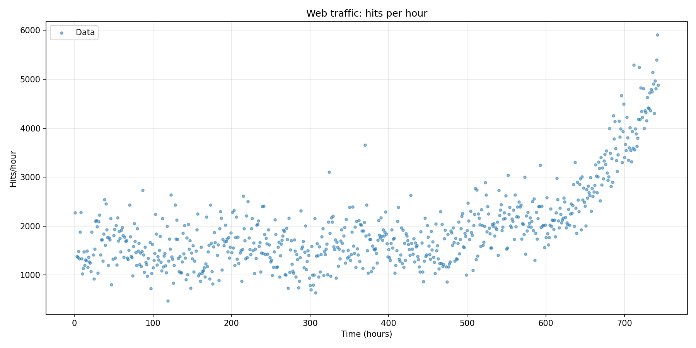
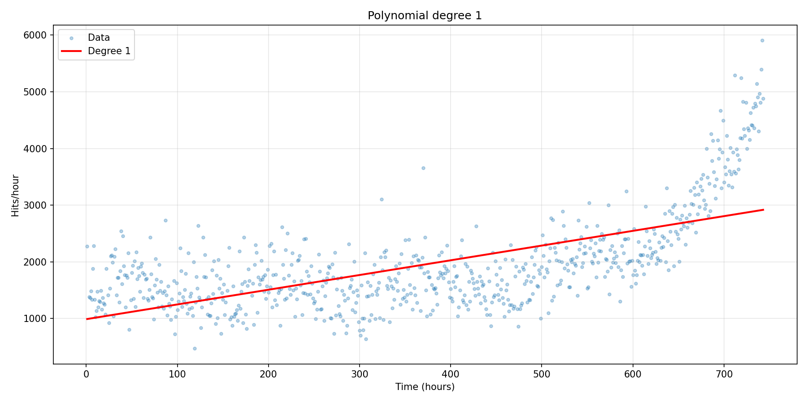
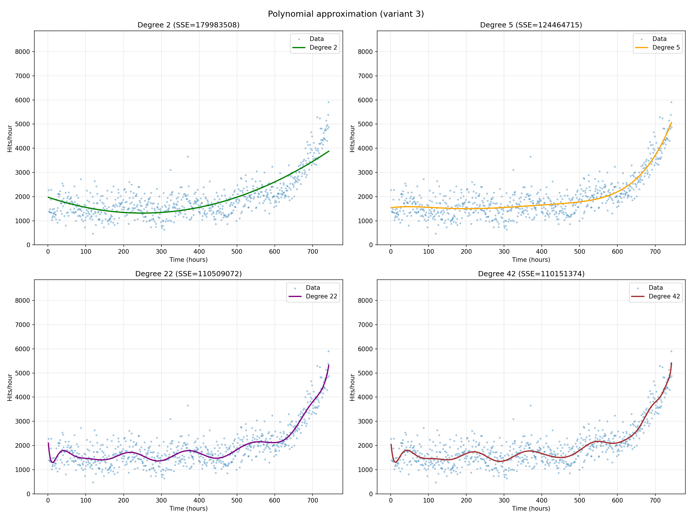
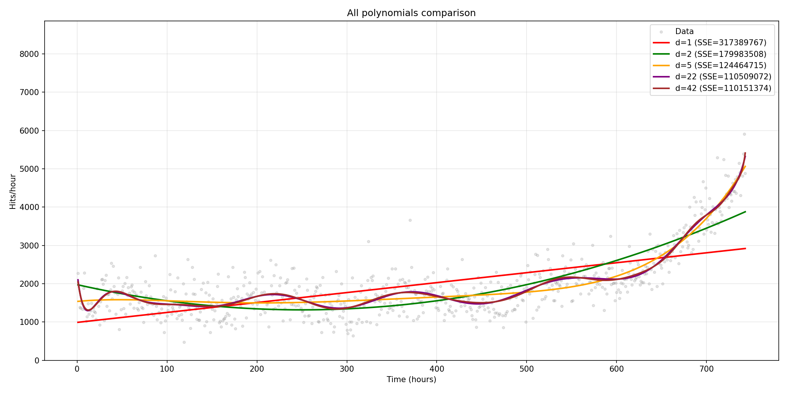
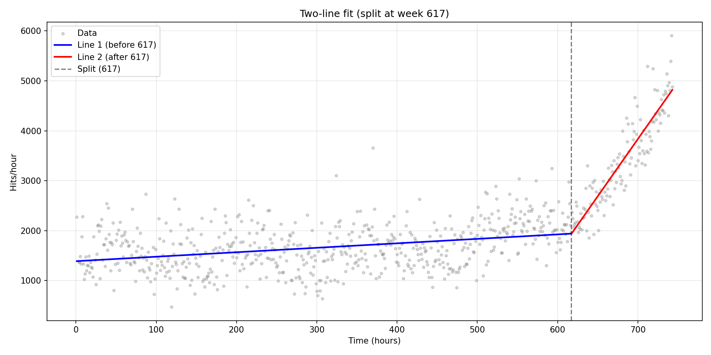
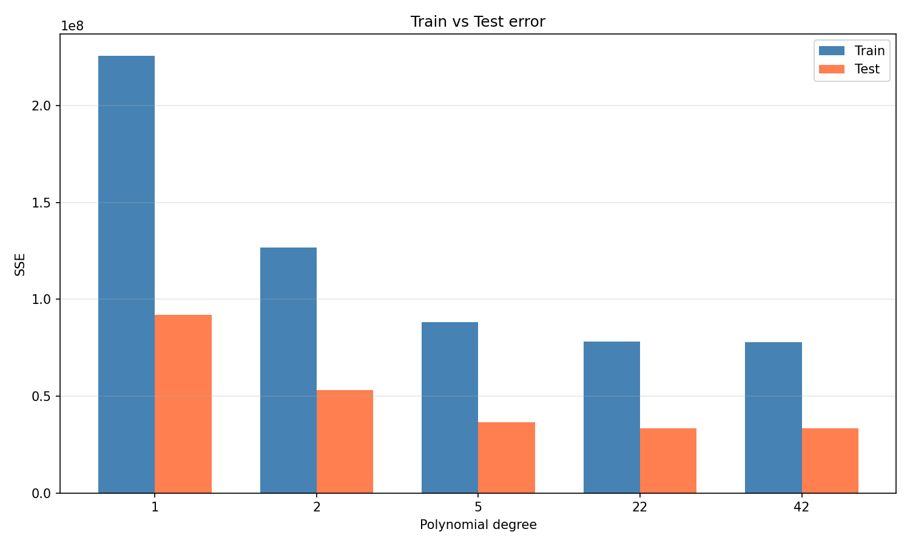
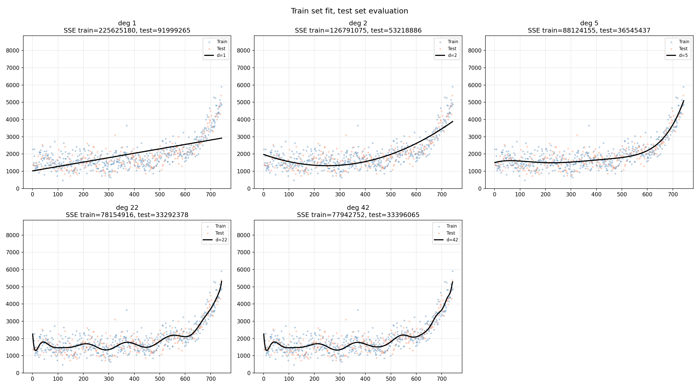
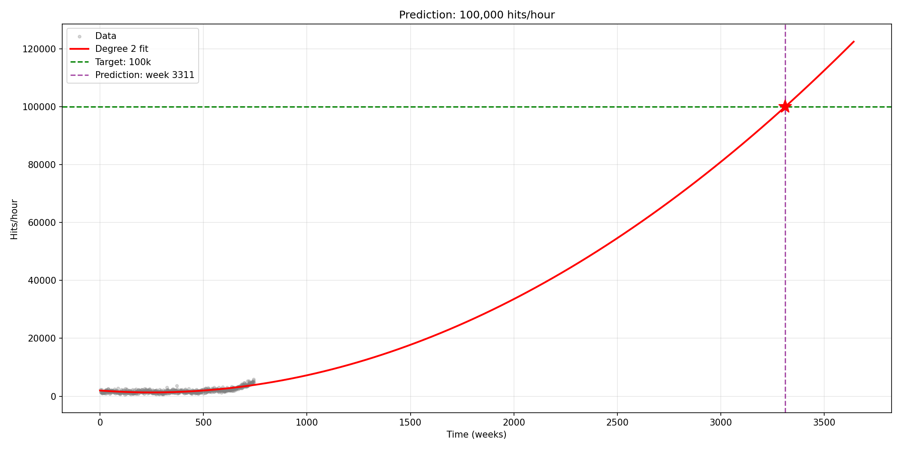

# Лабораторна робота №8

## Тема: Машинне навчання з Python (NumPy, Matplotlib)

**Мета:** Навчитися апроксимувати дані поліномами різних ступенів, оцінювати якість моделей та робити прогнози на основі даних веб-трафіку.

**Варіант:** 3 (ступені поліномів: 5, 22, 42)

---

## Теорія

Апроксимація – наближення набору точок математичною функцією. Тут використовується поліноміальна регресія – для точок (x, y) шукаємо поліном потрібного ступеня, що мінімізує SSE (суму квадратів відхилень). В NumPy для цього є `polyfit(x, y, deg)`.

Якщо ступінь занадто малий – модель не вловлює закономірності (underfitting). Якщо занадто великий – запам'ятовує шум (overfitting). Щоб це перевірити, дані ділять на train (70%) і test (30%) – навчаємо на train, оцінюємо на test.

---

## Хід роботи

### 2.1 Завантаження даних

```python
data = np.genfromtxt("web_traffic.tsv", delimiter="\t")
x = data[:, 0]
y = data[:, 1]

mask = ~np.isnan(y)
x, y = x[mask], y[mask]
```

Файл містить 743 записи. Після видалення NaN залишилось 735 точок.

### 2.2 Діаграма розсіювання

```python
plt.scatter(x, y, s=10, alpha=0.5)
```



Трафік зростає, причому в другій половині швидше.

### 2.3 Поліном 1-го ступеня

```python
fp1 = np.polyfit(x, y, 1)
f1 = np.poly1d(fp1)
```



SSE = 317,389,767. Пряма не вловлює нелінійний тренд – underfitting.

### 2.4 Поліноми вищих ступенів

```python
for deg in [2, 5, 22, 42]:
    fp = np.polyfit(x, y, deg)
    f = np.poly1d(fp)
    err = np.sum((y - f(x)) ** 2)
```



| Ступінь | SSE         |
| ------- | ----------- |
| 1       | 317,389,767 |
| 2       | 179,983,508 |
| 5       | 124,464,715 |
| 22      | 110,509,072 |
| 42      | 110,151,374 |

Після 5-го ступеня похибка падає дуже повільно. 22 і 42 дають майже однаковий результат.



### 2.5 Дві прямі лінії

Перебираємо точки розбиття і шукаємо мінімум сумарної SSE двох прямих:

```python
for split_idx in range(50, len(x) - 50):
    m1 = x <= x[split_idx]
    m2 = x > x[split_idx]
    err = error(m1) + error(m2)
```

Оптимальний розбив – тиждень 617. SSE = 132,228,668 (на 58.3% менше ніж одна пряма).



### 2.6 Train/test split

```python
np.random.seed(42)
indices = np.arange(len(x))
np.random.shuffle(indices)
split = int(len(x) * 0.7)
x_train, y_train = x[indices[:split]], y[indices[:split]]
x_test, y_test = x[indices[split:]], y[indices[split:]]
```

514 train, 221 test точок.

| Ступінь | SSE train   | SSE test   |
| ------- | ----------- | ---------- |
| 1       | 225,625,180 | 91,999,265 |
| 2       | 126,791,075 | 53,218,886 |
| 5       | 88,124,155  | 36,545,437 |
| 22      | 78,154,916  | 33,292,378 |
| 42      | 77,942,752  | 33,396,065 |





42-й ступінь на train трохи кращий, але на test вже гірший за 22-й – початок overfitting.

### 2.7 Прогноз

Беремо поліном 2-го ступеня і розв'язуємо рівняння f(x) = 100000:

```python
fp2 = np.polyfit(x, y, 2)
coeffs = fp2.copy()
coeffs[2] -= 100000
roots = np.roots(coeffs)
```

Прогноз: 100k звернень/год на тижні ~3311 (приблизно 63.7 років). Лінійна екстраполяція дає тиждень 4894.



---

## Висновки

В роботі апроксимував дані веб-трафіку поліномами різних ступенів. Лінійна модель погано описує дані, поліном 2-го ступеня вже значно краще (SSE менше на 43%). Поліноми 22 і 42 ступеня майже не покращують результат порівняно з 5-м. Розбиття на дві прямі (з точкою на тижні 617) дає покращення 58.3% відносно однієї прямої. Train/test показав що оптимально десь між 5 і 22 ступенем. За прогнозом, 100 тисяч звернень/год буде десь на тижні 3311.
